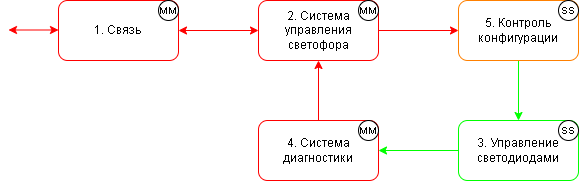
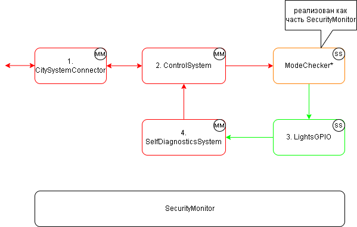

# Кибериммунный подход к разработке. Задача "Светофор"

**Вам предлагается доработать упрощённый прототип системы управления светофором** с учётом принципов конструктивной безопасности (кибериммунный подход). В данной задаче светофор рассматривается как набор функциональных компонентов, которые взаимодействуют строго через «монитор безопасности» (SecurityMonitor).  
Монитор безопасности выступает «центральным пропускным пунктом»: он принимает все сообщения от компонентов, проверяет их на соответствие заданной политике безопасности и либо передаёт адресату, либо блокирует.
## О задаче  
Указанная задача направлена на реализацию базовой компетенции федерального государственного образовательного стандарта высшего образования БК-3 - способность применять языки, методы и инструментальные средства программирования для решения задач профессиональной деятельности.  

*Необходимо показать, каким образом можно ограничивать и контролировать взаимодействие различных частей программы (подсистем) с помощью монитора безопасности, а также корректно реализовывать допустимые режимы работы светофора и блокировать потенциально аварийные.
Светофор - это, на первый взгляд, очень простая система, но она оказывает критическое влияние на безопасность дорожного движения.*

## Простая реализация выбранной политики архитектуры

В рамках задачи реализуется политика архитектуры, показанная на рис. 1.



Рис. 1. Политика архитектуры светофора

1. Есть несколько функциональных компонентов (сущности 1-4) и монитор безопасности, который будет контролировать их взаимодействие, в том числе реализовывать контроль конфигураций светофора (сущность №5 на архитектурной диаграмме)
2. Определены политики безопасности
3. Написан модуль ControlSystem моделирующий запрос на изменение режима для проверки работы всех элементов

- В качестве интерфейса взаимодействия использованы очереди сообщений, у каждой сущности есть своя «персональная» очередь, ассоциированная с ней
- Компоненты 1-4 отправляют сообщения только в очередь monitor сущности SecurityMonitor
- SecurityMonitor проверяет сообщения на соответствие политикам безопасности, в случае положительного решения перенаправляет сообщение в очередь соответствующей сущности

В коде сущности названы следующим образом
1. Связь - CitySystemConnector
2. Система управления светофора - ControlSystem
3. Управление светодиодами - LightsGPIO
4. Система диагностики - SelfDiagnosticsSystem

Логика контроля режимов светофора (компонент №5 на рис. 1) реализована в виде политики безопасности в мониторе безопасности **(эту логику нужно будет дополнить в задании 5)**.  



Рис. 2. Политика архитектуры с именами классов

Очередь событий для монитора безопасности: все запросы от сущностей друг к другу должны отправляться только в неё

Формат сообщений

### Монитор безопасности

Ниже в методе _check_policies можно увидеть пример политики безопасности:

```python
if event.source == "ControlSystem" \
        and event.destination == "LightsGPIO" \
        and event.operation == "set_mode" \ 
        and self._check_mode(event.operation):
    authorized = True
```            

В этом примере проверяется отправитель сообщения, получатель, запрашиваемая операция а также параметры операции. Это максимально строгий вариант, и в зависимости от ситуации количество проверок можно уменьшить.
В мониторе безопасности осуществляется контролируемая блокировка противоречащих полотикам взаимодействий между сущностями.

### Сущность ControlSystem

Эта сущность (Система управления светофора) отправляет сообщение для другой сущности (LightsGPIO)

### Сущность LightsGPIO

Эта сущность (Система управления светодиодами) ждёт входящее сообщение в течение заданного периода времени, и если получает - обрабатывает и завершает работу или выходит по таймауту. **(эту логику нужно будет изменить в задании 4)**

### Инициализируем монитор и сущности

регистрируем очереди сущностей в мониторе

### Запускаем всё

Ожидаемая последовательность событий


### Теперь останавливаем

## Заключение

В этом блокноте продемонстрирован базовый функционал контролируемого изменения режима работы светофора. 

В примере не реализованы некоторые сущности и большая часть логики работы светофора, которую можно предположить по архитектурной диаграмме. Попробуйте проделать это самостоятельно в соответствии с заданиями.

## Задания

### Уровень "Начальный"

1. **Измените режим на недопустимый (два зелёных).**  
   В коде `ControlSystem` измените запрос на установку недопустимого режима (оба направления «green»). Убедитесь, что при выполнении всех ячеек монитор безопасности (`Monitor` или `ModeChecker`) блокирует такое сообщение.  

2. **Разрешите режим «мигающий жёлтый» (yellow_blinking).**  
   Измените политики безопасности так, чтобы дополнительно стал разрешен режим с мигающим жёлтым (`"yellow_blinking"`) для обоих направлений одновременно. Убедитесь, что теперь этот режим пропускается системой (то есть не блокируется).  

### Уровень "Продвинутый"

3. **Добавьте политики безопасности для дополнительных секций со стрелками.**  
   Обновите в список разрешённых конфигураций светофора в `traffic_lights_allowed_configurations` (либо соответствующую структуру в `Monitor` или `ModeChecker`) так, чтобы система дополнительно поддерживала режимы с двумя боковыми секциями поворота (налево/направо) для каждого из обоих направлений, и учитывала эти сигналы в процессе проверки (например добавить разрешенную конфигурацию {"direction_1": "green", "direction_1_left": "green", "direction_1_right": "green", "direction_2": "red", "direction_2_right": "green"} и др.).  

4. **Измените код сущностей, чтобы они работали произвольное время пока не получат команду «stop».**  
   Внесите изменения в код сущностей, чтобы они не завершались автоматически по таймеру (как это сейчас сделано в блокноте), а работали на протяжении всего выполнения программы, пока не получат команду «stop» (по аналогии как это реализовано в мониторе безопасности).  
   Сделайте так, чтобы:  
   - `ControlSystem` генерировал различные команды раз в 3 секунды.  
   - `ModeChecker`, `LightsGPIO`, `ControlSystem` и `Monitor` завершали работу только после получения команды `stop`.  
   - Установить таймер выполнения программы на 60 секунд sleep(60) после чего должна выполняться команда `stop`.  

5. **Разделите класс `Monitor` на два класса: `Monitor` и `ModeChecker`.**  
   - Перенесите логику проверки режимов из `Monitor` в отдельный класс `ModeChecker`, а в `Monitor` оставьте только контроль взаимодействия между компонентами (проверку отправителя, получателя, типа запроса и пр.).
   - Обновите политики в `Monitor` так, чтобы он пропускал сообщение `set_mode` лишь от `ControlSystem` к `ModeChecker` и от `ModeChecker` к `LightsGPIO`.
